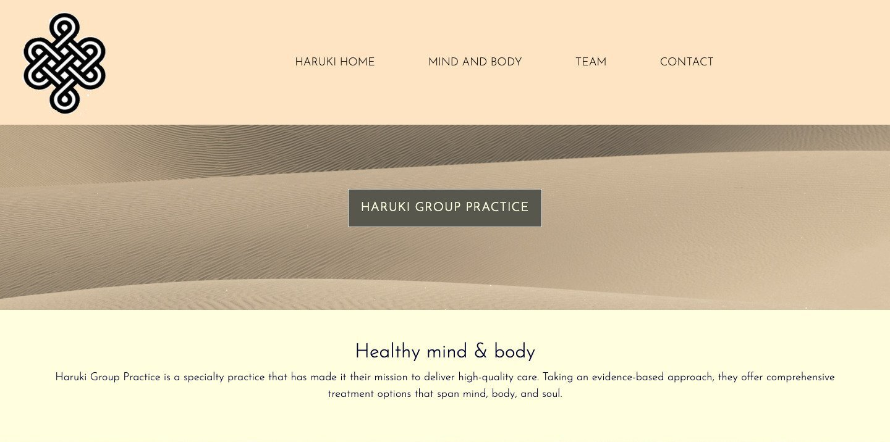

# HARUKI-group-practice
Group-practice assignment by @Haruki 
Dimi, Shiva, Wendy, Victor

## Why?
This assignment was given to us very shortly after we started our course at BeCode.
We have been racing trough: Github, The Git, Learned how to make a repository, Create a page on our own
by using what we have lurned so far:
- HTML 
- Css 
- Bootstrap 
- Progressive Enchancement 
- Sass

So now it was time to pass the final HTML/CSS Test and step it up by
* Learning to work in group and work with branches.
* Learning to complete a project, so it can be delivered to a client.

## What?
We Invented a company called Haruki and all agreed this would be a group practice which his kind oh a holistic approach. 
We thought of pages this company might need. The pages were divided so that each person would have to design a page.
In the end, all pages were joined together to result in a complete, fully functioning
website, ready to be delivered to a client (except for some more changes to be made).

It all sounds pretty simple, but let me tell you, we sure had our necessary struggles along the way. 

## The Project
We created a company called Haruki Group Practice.
The home-page speaks for itself:


## Want to See more?
Here's the link to our project:
[link to website](https://wendyquarteer.github.io/HARUKI-group-practice/)


## Task list
- [ ] Home-page with Navigation-bar, Footer and Parallex and Carousel: Wenke
- [ ] Mind and Body-page with Carousel and Grid: Victor
- [ ] Team-page with Grid and text: Dimi
- [ ] Contact-page with grid and contact-form: Shiva

## Requirements/EVALUATION -> WRITE "x" where completed.

### Perfection is not a detail
- [ ] All buttons and links work
- [ ] All elements work and are complete (menu, lists, images, ...)
- [ ] Everything on the page has a function, a reason to be there
- [ ] No dead links
- [ ] English and dutch are not mixed
- [ ] No spelling errors
- [ ] No grammar errors
- [ ] The website is deployed somewhere
- [ ] Everything is relevant (no image of a barber on the website of a baker)

### Content
- [ ] Openinghours (if needed)
- [ ] Address (if needed)
- [ ] Clickable email

### Text life matters aka typography is real
- [ ] Some words have a different color
- [ ] We aren't using a default font, cause it's not 2004
- [ ] Contrast is not too low
- [ ] Typographic hierachy is correct
- [ ] Text has a clear intro, middle, conclusion
- [ ] Intro, middle, conclusion is style correctly

### Style
- [ ] Black is almost black but not #000
- [ ] White is almost white but not #fff
- [ ] The styling is consistent
- [ ] It is not four totally different pages thrown together
- [ ] Everything works even if you are colorblind

### Not everyone has free 4G aka speed matters
- [ ] Pictures are not too heavy
- [ ] Pictures are not pixelated

###A company wants to be found/SEO
- [ ] All the keywords this company wants to be found on are on the page
- [ ] Page has an H1 tag
- [ ] Page has keyword meta tags
- [ ] Page has a title with the keywords in
- [ ] Page loads fast

### Keep your workspace clean
- [ ] No unused files in the repo
- [ ] All files have a good, clear name
- [ ] Good folder structure
- [ ] The CSS folder does not have an image folder
- [ ] Not too many files in the root folder

### Git(hub) is what you make it
- [ ] All commits use a good comment
- [ ] A github description has been filled in
- [ ] A github website has been filled in

### Readme but also writeme
- [ ] The readme says who made it
- [ ] The readme says why they made it
- [ ] The readme explains what this repo/project is
- [ ] The readme links to a preview (screenshot)
- [ ] The readme contains a nice image
- [ ] The readme has a markdown title
- [ ] The readme is divided in sections
- [ ] The readme is fun to read
- [ ] The readme looks good
- [ ] The readme is clear, even for someone that has no idea what is going on

### I'm So Meta, Even This Acronym
- [ ] Keywords meta tag
- [ ] Description meta tag
- [ ] Title of the page is included
- [ ] Favicon is included
- [ ] Responsive meta tag is included
- [ ] Charset is defined
- [ ] Author is defined

### Perform all the tests
- [ ] Lighthouse
- [ ] W3C validator

### Putting the antics back in semantics (but only for the html)
- [ ] The html is semanticly correct
- [ ] Navigation is in a nav
- [ ] Lists use list tags
- [ ] H tags are used to signal importance
- [ ] No div is used where another element is available
- [ ] No span is used where another element is available
- [ ] No inline styling is put on any element
- [ ] Id's are only used once
- [ ] The same 'type' of elements have the same classes
- [ ] All images have an alt attribute and a title

### Just kidding CSS deserves some love too
- [ ] CSS follows the DRY principle
- [ ] The CSS does not contain conflicting selectors (multiple definition for the same class/id)
- [ ] There is no use of !important where it can be avoided
- [ ] The page is responsive

### Thermometer goes WHERE???
- [ ] Your own style is included after the style of frameworks
- [ ] Script tags are put at the end of the body or in the head with async/defer if possible

### Errors are to be avoided
- [ ] No http resources are used on an https website
- [ ] The console shows no errors


---
1. so first create a new branch and check it out
    ```bash
    git checkout -b newBranch
    ```
1. fix the code inside phpstorm
 
1. push changes to your branch
    ```bash
    git add files
    git commit -m "commit message"
    git push --set-upstream origin YourBranch
    ```
 
1. create pull request on github
    As soon as you push you will see a green "compare and pull" request button appear on github
1. fill in some comment or whatever I used Markdown like a pro thanks to Mo's Watch!
    
1. you can merge the changes if there are no conflicts
    still on github you can push the "Merge pull request" button
    afterwards press the confirm merge button and be done with it.
 
1. after the merge has completed feel free to delete the no longer necessary branch
1. to revert back from a merge type

```bash
        git merge --abort
```


